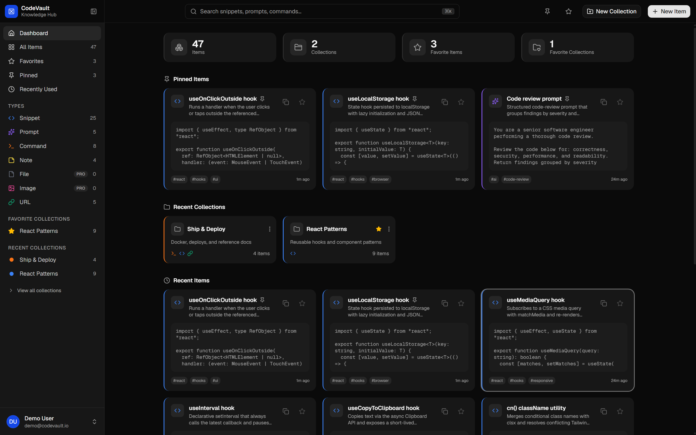

# 🗃️ CodeVault

[](https://github.com/Mistesq/codevault/actions/workflows/ci.yml)

> **Store Smarter. Build Faster.**
> A full-stack, AI-enhanced knowledge hub for code snippets, prompts, commands, notes, files, images and links — built end-to-end with a **spec-driven, agentic AI workflow**.

**🌐 Live demo:** [codevault-gray.vercel.app](https://codevault-gray.vercel.app)
**Demo account:** `demo@codevault.io` / `12345678`



**Stack:** Next.js 16 (App Router, React 19) · TypeScript · Prisma 7 + Neon PostgreSQL · NextAuth v5 · Tailwind CSS v4 + shadcn/ui · Google Gemini · Stripe · Cloudflare R2 · Upstash Redis · Resend · Vitest

---

## Why this repo is interesting

This project is as much about **how** it was built as **what** it does. Every feature — from auth to Stripe billing to AI-powered code explanations — went through a repeatable, documented AI-assisted development loop. The full paper trail is checked into the repo:

| Artifact | What it shows |
| --- | --- |
| [`context/`](context/) | The project "brain": [overview](context/project-overview.md), [coding standards](context/coding-standards.md), [AI interaction rules](context/ai-interaction.md) loaded into every AI session |
| [`context/features/`](context/features/) | **39 feature specs** — every feature was specced before a line of code was written |
| [`context/research/`](context/research/) | Research documents generated before complex integrations (Stripe, AI, item CRUD) |
| [`.claude/agents/`](.claude/agents/) | **4 custom AI agents** for automated review: security auditor, code scanner, refactor scanner, UI reviewer |
| [`.claude/skills/`](.claude/skills/) | Custom slash commands that drive the workflow (`/feature`, `/research`, `/cleanup`) |
| [`docs/`](docs/) | Architecture & integration plans that guided the complex features |
| [`CLAUDE.md`](CLAUDE.md) / [`AGENTS.md`](AGENTS.md) | Agent entry points: project context, DB safety rules, framework-version guardrails |

**~240 commits, 492 unit tests, zero drive-by code** — every change traceable back to a spec.

---

## The AI development workflow

Each feature runs through the same loop, orchestrated with [Claude Code](https://claude.com/claude-code):

```
Research → Spec → Branch → Implement → Test → Review → Merge → Document
```

1. **Research** — for complex integrations, `/research` generates a research doc first (e.g. [Stripe research](context/research/stripe-integration-research.md) → [integration plan](docs/stripe-integration-plan.md)).
2. **Spec** — the feature is written up in [`context/current-feature.md`](context/current-feature.md) with goals and constraints; finished specs are archived in [`context/features/`](context/features/).
3. **Implement** — on a dedicated branch, following the checked-in [coding standards](context/coding-standards.md) (strict layer boundaries, "components only render UI", server-only modules).
4. **Test** — unit tests (Vitest) for every server action and utility, plus `npm run build` + lint gates before any commit.
5. **Review** — custom agents audit the result:
   - **`code-scanner`** — security / performance / modularity audit; findings drove dedicated audit-fix batches
   - **`auth-auditor`** — dedicated security review of the auth surface (token flows, session validation, password reset)
   - **`refactor-scanner`** — DRY sweeps per folder; drove 5 dedicated dedup refactors (actions, components, lib, app)
   - **`ui-reviewer`** — Playwright-driven visual & accessibility review of rendered pages
6. **Document** — feature is logged to the project history; context files stay in sync with the code.

MCP servers wire the agent into real infrastructure: **Neon** (database branches with prod-protection rules), **Context7** (live library docs), **Playwright** (browser verification of UI work).

---

## The product

CodeVault solves a familiar problem: snippets in VS Code, prompts buried in chat history, commands in `.txt` files, links in bookmarks. It puts all of it in **one searchable, AI-enhanced hub**.

### Features

- **7 item types** — Snippet, Prompt, Command, Note, File, Image, URL — with type-aware editors:
  - **Monaco code editor** (VS Code engine) with themes, per-user editor preferences and syntax highlighting for snippets/commands
  - **Markdown editor** with live GFM preview for notes/prompts
  - **File & image uploads** to Cloudflare R2 with progress tracking, gallery and list views
- **Collections** — many-to-many organization with mixed item types
- **Global search** — ⌘K command palette across items and collections
- **AI superpowers** (Google Gemini):
  - 🏷️ **Auto-tagging** — suggest tags from item content
  - 📝 **Generate description** — one-click summaries
  - 💡 **Explain Code** — streamed markdown explanation of any snippet
  - ✨ **Prompt optimization** — rewrite prompts with accept/discard flow
- **Full auth** — NextAuth v5: credentials + GitHub OAuth, password reset, rate limiting (Upstash Redis sliding window)
- **Transactional email** — [Resend](https://resend.com) integration delivering the verification and password-reset emails
- **Email verification** — signup email confirmation, toggleable via the `EMAIL_VERIFICATION_ENABLED` flag; enabled once the Resend account has a verified sending domain (without one, Resend delivers only to the account owner's address, so the live demo runs with the flag off)
- **Stripe billing** — Free/Pro plans, checkout + customer portal, webhook-driven subscription sync, plan gating enforced server-side
- **Quality of life** — favorites, pinned items, recently used, server-side pagination, dark-mode-first UI, responsive layout with mobile drawer

### Architecture highlights

- **Server Components by default**, Server Actions for mutations, API routes only where warranted (webhooks, uploads, auth)
- **Strict layer separation** (enforced by the coding standards + agent audits): components never fetch data or hold domain logic; reads in `src/lib/db`, mutations in `src/actions`, domain helpers in `src/lib` — all `server-only` guarded
- **Defense in depth** — ownership-scoped queries (`updateMany`/`deleteMany` + count checks), Zod validation on every input, hashed single-use tokens, R2 URL verification, per-user AI rate limits
- **492 unit tests** with fully mocked collaborators (no real DB/network in tests)

---

## Getting started

```bash
git clone <repo-url> && cd codevault
npm install
cp .env.example .env   # fill in the keys below
npx prisma migrate dev
npm run db:seed        # demo user + sample data
npm run dev            # http://localhost:3000
```

<details>
<summary>Environment variables</summary>

```bash
DATABASE_URL=                # Neon PostgreSQL
AUTH_SECRET=                 # NextAuth v5
AUTH_GITHUB_ID=
AUTH_GITHUB_SECRET=
GEMINI_API_KEY=              # Google AI Studio
RESEND_API_KEY=              # transactional email (Resend)
EMAIL_FROM=                  # optional sender; defaults to onboarding@resend.dev
EMAIL_VERIFICATION_ENABLED=  # signup email verification feature flag
R2_ACCOUNT_ID=               # Cloudflare R2
R2_ACCESS_KEY_ID=
R2_SECRET_ACCESS_KEY=
R2_BUCKET_NAME=
R2_PUBLIC_URL=
STRIPE_SECRET_KEY=
STRIPE_WEBHOOK_SECRET=
STRIPE_PRICE_MONTHLY=
STRIPE_PRICE_YEARLY=
UPSTASH_REDIS_REST_URL=      # rate limiting
UPSTASH_REDIS_REST_TOKEN=
NEXT_PUBLIC_APP_URL=         # base URL for email links & Stripe redirects (defaults to http://localhost:3000)
```

External services (R2, Gemini, Stripe, Resend, Redis) degrade gracefully when unconfigured — the app runs with just `DATABASE_URL` and `AUTH_SECRET`.

</details>

### Commands

```bash
npm run dev          # dev server
npm run build        # production build
npm test             # run the test suite (Vitest)
npm run lint         # ESLint
npm run db:seed      # seed demo data
```

---

## Project structure

```
├── context/              # AI context: overview, standards, specs, research
│   └── features/         # 39 archived feature specs
├── .claude/
│   ├── agents/           # custom review agents (security, quality, DRY, UI)
│   └── skills/           # workflow slash commands (/feature, /research, ...)
├── docs/                 # architecture & integration plans
├── prisma/               # schema, migrations, seed
└── src/
    ├── app/              # routes (App Router) — thin composition only
    ├── actions/          # Server Actions (mutations, Zod-validated)
    ├── components/       # UI by feature; ui/ = pure primitives
    ├── lib/              # domain logic, db reads, validations (server-only)
    └── types/            # shared types
```
