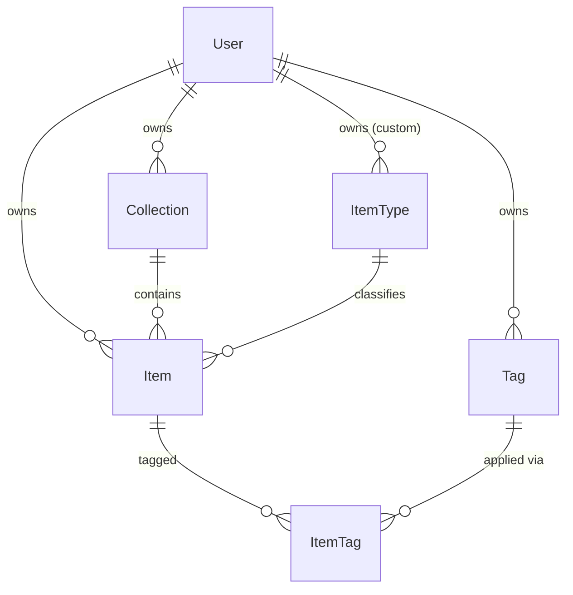
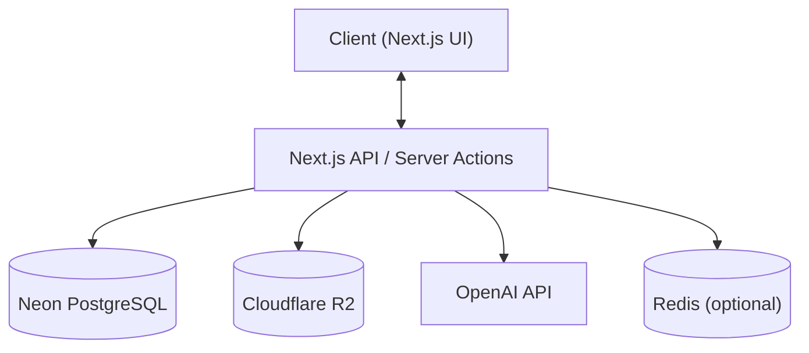
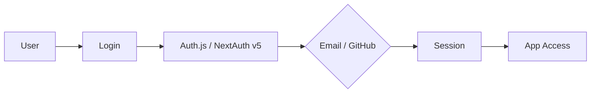
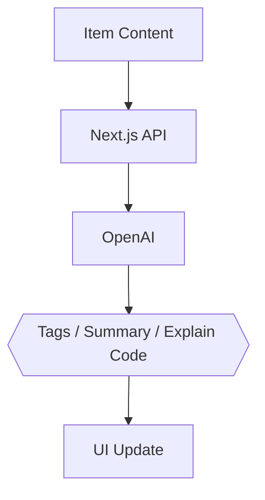

# 🗃️ CodeVault — Project Overview

> **Store Smarter. Build Faster.**
> A centralized, AI-enhanced knowledge hub for code snippets, prompts, docs, commands, and more.

---

## 📌 Problem

Developers keep their essentials scattered across too many places:

- Code snippets in VS Code or Notion
- AI prompts buried in chat histories
- Context files lost inside random projects
- Useful links in browser bookmarks
- Docs in unstructured folders
- Commands in `.txt` files or bash history
- Project templates in GitHub gists

The result: **constant context switching, lost knowledge, and inconsistent workflows.**

➡️ **CodeVault gives you ONE searchable, AI-enhanced hub for all of it.**

---

## 🧑‍💻 Target Users

| Persona                       | Core Need                                 |
| ----------------------------- | ----------------------------------------- |
| 👨‍💻 Everyday Developer         | Quick access to snippets, commands, links |
| 🤖 AI-First Developer         | Store prompts, workflows, and contexts    |
| 🎓 Content Creator / Educator | Save course notes and reusable code       |
| 🏗️ Full-Stack Builder         | Patterns, boilerplates, API references    |

---

## ✨ Core Features

### A) Items & System Item Types

Every item belongs to one built-in type:

`Snippet` · `Prompt` · `Note` · `Command` · `File` · `Image` · `URL`

> Custom item types are available to **Pro** users.

### B) Collections

Organize items into collections — mixed item types allowed.
_Examples:_ React Patterns · Context Files · Python Snippets

### C) Search 🔍

Full-text search across **content, tags, titles, and types**.

### D) Authentication 🔐

- Email + Password
- GitHub OAuth

### E) Quality-of-Life Features

- ⭐ Favorites & 📌 pinned items
- 🕘 Recently used
- 📥 Import from files
- 📝 Markdown editor for text items
- 📎 File uploads (images, docs, templates)
- 📤 Export (JSON / ZIP)
- 🌙 Dark mode (default)

### F) AI Superpowers 🧠

- Auto-tagging
- AI summaries
- Explain Code
- Prompt optimization

> AI powered by **OpenAI** (model: `gpt-5-nano`).

---

## 🗄️ Data Model — Rough Prisma Draft

> ⚠️ **This is a rough draft and will evolve.** It assumes the [Auth.js / NextAuth v5](https://authjs.dev) Prisma adapter. If you use the **Credentials** provider (email + password), you'll likely run the **JWT** session strategy, in which case the `Session` model below is optional.

```prisma
// ---------- Enums ----------

enum ContentType {
  TEXT
  FILE
}

// ---------- Domain ----------

model User {
  id                   String   @id @default(cuid())
  email                String   @unique
  emailVerified        DateTime?
  name                 String?
  image                String?
  password             String?  // null for OAuth-only accounts
  isPro                Boolean  @default(false)
  stripeCustomerId     String?  @unique
  stripeSubscriptionId String?  @unique

  accounts    Account[]
  sessions    Session[]
  items       Item[]
  itemTypes   ItemType[]
  collections Collection[]
  tags        Tag[]

  createdAt DateTime @default(now())
  updatedAt DateTime @updatedAt
}

model Item {
  id          String      @id @default(cuid())
  title       String
  contentType ContentType @default(TEXT)
  content     String?     @db.Text // used for text-based types
  fileUrl     String?
  fileName    String?
  fileSize    Int?
  url         String?
  description String?
  language    String?     // for syntax highlighting, e.g. "tsx", "bash"
  isFavorite  Boolean     @default(false)
  isPinned    Boolean     @default(false)

  userId String
  user   User   @relation(fields: [userId], references: [id], onDelete: Cascade)

  typeId String
  type   ItemType @relation(fields: [typeId], references: [id])

  collectionId String?
  collection   Collection? @relation(fields: [collectionId], references: [id], onDelete: SetNull)

  tags ItemTag[]

  createdAt DateTime @default(now())
  updatedAt DateTime @updatedAt

  @@index([userId])
  @@index([collectionId])
}

model ItemType {
  id       String  @id @default(cuid())
  name     String
  icon     String?
  color    String?
  isSystem Boolean @default(false) // built-in types vs. custom (Pro)

  userId String? // null for system types shared across all users
  user   User?   @relation(fields: [userId], references: [id], onDelete: Cascade)

  items Item[]

  @@index([userId])
}

model Collection {
  id          String  @id @default(cuid())
  name        String
  description String?
  isFavorite  Boolean @default(false)

  userId String
  user   User   @relation(fields: [userId], references: [id], onDelete: Cascade)

  items Item[]

  createdAt DateTime @default(now())
  updatedAt DateTime @updatedAt

  @@unique([userId, name]) // no duplicate collection names per user
}

model Tag {
  id     String @id @default(cuid())
  name   String
  userId String
  user   User   @relation(fields: [userId], references: [id], onDelete: Cascade)

  items ItemTag[]

  @@unique([userId, name]) // no duplicate tag names per user
}

model ItemTag {
  itemId String
  tagId  String

  item Item @relation(fields: [itemId], references: [id], onDelete: Cascade)
  tag  Tag  @relation(fields: [tagId], references: [id], onDelete: Cascade)

  @@id([itemId, tagId])
}

// ---------- Auth.js adapter models ----------

model Account {
  id                String  @id @default(cuid())
  userId            String
  type              String
  provider          String
  providerAccountId String
  refresh_token     String?
  access_token      String?
  expires_at        Int?
  token_type        String?
  scope             String?
  id_token          String?
  session_state     String?

  user User @relation(fields: [userId], references: [id], onDelete: Cascade)

  @@unique([provider, providerAccountId])
}

model Session {
  id           String   @id @default(cuid())
  sessionToken String   @unique
  userId       String
  expires      DateTime
  user         User     @relation(fields: [userId], references: [id], onDelete: Cascade)
}

model VerificationToken {
  identifier String
  token      String
  expires    DateTime

  @@unique([identifier, token])
}
```

### Entity Relationships



---

## 🧱 Tech Stack

| Category     | Choice                                                                          |
| ------------ | ------------------------------------------------------------------------------- |
| Framework    | [**Next.js**](https://nextjs.org) (React 19)                                    |
| Language     | [TypeScript](https://www.typescriptlang.org)                                    |
| Database     | [Neon PostgreSQL](https://neon.tech) + [Prisma ORM](https://www.prisma.io)      |
| Caching      | [Redis](https://redis.io) (optional)                                            |
| File Storage | [Cloudflare R2](https://developers.cloudflare.com/r2)                           |
| CSS / UI     | [Tailwind CSS v4](https://tailwindcss.com) + [shadcn/ui](https://ui.shadcn.com) |
| Auth         | [NextAuth v5 / Auth.js](https://authjs.dev) (email + GitHub)                    |
| AI           | [OpenAI](https://platform.openai.com) (`gpt-5-nano`)                            |
| Deployment   | [Vercel](https://vercel.com) (likely)                                           |
| Monitoring   | [Sentry](https://sentry.io) (later)                                             |
| Payments     | [Stripe](https://stripe.com)                                                    |

---

## 💰 Monetization

| Plan    | Price           | Limits                  | Features                                        |
| ------- | --------------- | ----------------------- | ----------------------------------------------- |
| 🆓 Free | $0              | 50 items, 3 collections | Basic search, image uploads, no AI              |
| ⭐ Pro  | $8/mo or $72/yr | Unlimited               | File uploads, custom types, AI features, export |

> Billing via [Stripe](https://stripe.com) subscriptions, with webhooks syncing plan state back to the `User` model.

---

## 🎨 UI / UX

- 🌙 Dark mode first
- Minimal, developer-friendly interface
- Syntax highlighting for code
- Inspired by **Notion**, **Linear**, and **Raycast**

### Screenshots

Refer to the screenshots below as a
base for the dashboard UI. It does not have to be exacct. Use it as a reference:

@context/screenshots/dashboard-ui-main.png
@context/screenshots/dashboard-ui-drawer.png

### Layout

- **Collapsible sidebar** with filters & collections
- Main grid / list workspace
- Full-screen item editor

### Responsive

- Mobile drawer for the sidebar
- Touch-optimized icons and buttons

---

## 🔌 API Architecture



---

## 🔐 Auth Flow



---

## 🧠 AI Feature Flow



---

## ⚙️ Environment Setup

Starter `.env` keys for the chosen stack:

```bash
# Database (Neon)
DATABASE_URL=

# Auth.js / NextAuth v5
AUTH_SECRET=
AUTH_GITHUB_ID=
AUTH_GITHUB_SECRET=

# OpenAI
OPENAI_API_KEY=

# Cloudflare R2
R2_ACCOUNT_ID=
R2_ACCESS_KEY_ID=
R2_SECRET_ACCESS_KEY=
R2_BUCKET_NAME=
R2_PUBLIC_URL=

# Stripe
STRIPE_SECRET_KEY=
STRIPE_WEBHOOK_SECRET=
NEXT_PUBLIC_STRIPE_PUBLISHABLE_KEY=

# Redis (optional)
REDIS_URL=
```

---

## 🛠️ Development Workflow (Course)

- **One branch per lesson** so students can follow and compare
- Use **Cursor / Claude Code / ChatGPT** for assistance
- **Sentry** for runtime monitoring & error tracking
- **GitHub Actions** (optional CI)

```bash
git switch -c lesson-01-setup
```

---

## 🧭 Roadmap

### MVP

- Items CRUD
- Collections
- Search
- Basic tags
- Free-tier limits

### Pro Phase

- AI features
- Custom item types
- File uploads
- Export
- Billing & upgrade flow

### Future Enhancements

- Shared collections
- Team / Org plans
- VS Code extension
- Browser extension
- Public API + CLI tool

---

## ❓ Open Questions / Decisions to Make

- **Session strategy:** Credentials (email + password) forces the JWT strategy in Auth.js. Confirm it coexists cleanly with GitHub OAuth before building.
- **Search engine:** Start with Postgres full-text search / `pg_trgm`, or reach for a dedicated search service early? Affects schema and indexing.
- **Upload limits:** Define max file size and total storage per plan, enforced both client- and server-side.
- **AI cost controls:** Per-user rate limiting / usage caps to keep OpenAI spend predictable.
- **Free-tier enforcement:** How do custom item types and the 50-item / 3-collection caps interact at the DB and UI layers?
- **Deletes:** Soft delete (trash / restore) vs. hard delete — decide before items reference each other heavily.

---

## 📌 Status

- 🟡 In planning
- ✅ Ready for environment setup & UI scaffolding

---

🏗️ **CodeVault — Store Smarter. Build Faster.**
